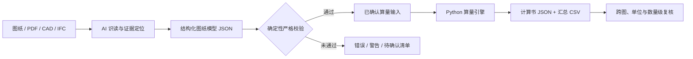

<div align="center">

# 🏗️ Engineering AI Skill

### 可追溯的工程识图、图纸校验与工程量计算

**AI 负责取证，Python 负责确定性校验与计算。任何不确定项都被显式标记，而不是用经验值补齐。**


[快速开始](#-快速开始) · [核心能力](#-核心能力) · [数据模型](#-数据模型) · [项目结构](#-项目结构) · [文档](#-文档导航)

</div>

---

## ✨ 项目简介

Engineering AI Skill 是一套面向建筑、结构和机电工程资料的 **Codex Skill + 确定性 Python 引擎**。它把工程识图工作拆成一条可审计的数据链：

1. 从图纸、PDF、CAD 导出图或 IFC 资料中提取事实并保存定位证据。
2. 将图纸台账、轴网、标高、构件和 OCR 复核结果写入结构化 JSON。
3. 在进入算量前执行确定性校验，阻断版本冲突、尺寸链错误和低置信度数据。
4. 仅对已确认输入执行单位安全的工程量计算。
5. 输出带来源、公式、状态和异常信息的 JSON 计算书及 Excel 兼容 CSV。

> 核心原则：**先取证，后判断；先校验，再计算；最后复核。**

## 🔄 工作流程



这条流程刻意把“理解图纸”和“执行计算”分开：AI 可以处理上下文和证据关联，但最终数值由可测试、可复现的代码生成。

## 🚀 快速开始

### 环境要求

- Python 3.9 或更高版本
- 无第三方 Python 依赖，仅使用标准库

```powershell
git clone https://github.com/lizhixin066/Engineering-AI-Skill.git
cd Engineering-AI-Skill
```

### 1. 校验图纸识读模型

```powershell
python scripts/validate_drawing_model.py examples/drawing_model.json `
  --output outputs/drawing-report.json `
  --strict
```

示例模型通过后会输出 `图纸模型校验通过`，并生成包含统计摘要和问题清单的 `outputs/drawing-report.json`。

### 2. 生成工程量计算书

```powershell
python scripts/calculate_takeoff.py examples/basic_takeoff.json `
  --output outputs/basic-result.json `
  --csv outputs/basic-summary.csv
```

该示例包含一个 `inferred` 项，因此非严格模式会完成计算并保留警告。生产数据可增加 `--strict`，拒绝无来源或非 `confirmed` 项。

### 3. 运行全部回归测试

```powershell
python -m unittest discover -s tests -v
```

## 🧩 核心能力

### 图纸识读模型校验

- **图纸台账**：检查图号、图名、专业、版次、比例、单位和有效状态。
- **版本控制**：阻止同一图号存在多个有效版次，避免被替代图纸进入最终结果。
- **轴网尺寸链**：核对分段尺寸之和与总尺寸，超过 1 mm 允许差即生成阻断问题。
- **标高检查**：支持负标高，同时校验单位、来源、状态与置信度。
- **构件检查**：按类别检查必填量测字段，并以“构件编号 + 楼层”识别重复项。
- **OCR 双读复核**：同一区域两次结果不一致时阻断后续自动计算。
- **数据安全**：拒绝 NaN、Infinity、错误集合类型和不适用单位。

图纸模型当前覆盖：

`room` · `wall` · `door` · `window` · `opening` · `column` · `beam` · `slab` · `stair` · `foundation` · `rebar` · `pipe` · `duct` · `cable` · `equipment`

### 工程量计算

| 分组 | 支持类型 | 主要计算结果 |
|---|---|---|
| 面积 | `area` | 长度 × 宽度 − 扣减面积 |
| 混凝土/实体 | `rectangular_prism`, `beam`, `column`, `slab` | m³ 设计净量 |
| 砌体 | `wall_masonry` | 墙体积 − 洞口体积 |
| 装修 | `wall_finish` | 单/双面展开面积 − 洞口面积 |
| 模板 | `formwork_rectangular_prism` | 侧模面积，可选顶面与底面 |
| 钢筋 | `rebar` | 根数 × 单根长度 × 单位重，支持 `d²/162` |
| 管线 | `pipe` | m 延长米 |
| 计数 | `count` | each 数量 |

计算引擎自动完成 `mm`、`cm`、`m` 的长度换算，结果统一保留到 0.001。只有项目口径明确时才应设置 `waste_factor`；默认结果为设计净量。

### 可追溯交付

每个计算结果都会保留：

- `gross_quantity`：扣减前毛量
- `net_quantity`：扣减后设计净量
- `quantity`：按明确损耗率调整后的结果
- `formula`：实际采用的计算公式
- `source_refs`：图号、页码、轴线或构件定位
- `status`：`confirmed`、`inferred` 或 `pending`
- `warnings`：缺失来源、未确认状态等问题

## 🗂️ 数据模型

### 图纸识读模型

图纸观察先写入 [examples/drawing_model.json](examples/drawing_model.json)：

```json
{
  "project": "示例工程",
  "drawings": [],
  "axis_chains": [],
  "elevations": [],
  "components": [],
  "ocr_checks": []
}
```

完整字段、构件量测要求和单位约束见 [图纸识读模型说明](docs/drawing-model.md)。

### 算量输入

通过图纸校验的构件再转换为 [examples/basic_takeoff.json](examples/basic_takeoff.json) 所示的算量格式：

```json
{
  "project": "示例工程",
  "items": [
    {
      "id": "S-SLAB-001",
      "type": "slab",
      "source_refs": ["S-101/轴1-4/A-C"],
      "status": "confirmed",
      "inputs": {
        "length": {"value": 7200, "unit": "mm"},
        "width": {"value": 4800, "unit": "mm"},
        "thickness": {"value": 120, "unit": "mm"}
      }
    }
  ]
}
```

详细格式见 [计算器输入规范](docs/input-schema.md)。

### 状态与严格模式

| 状态 | 含义 | 严格模式 |
|---|---|---|
| `confirmed` | 有可定位来源，且置信度为 High 或 Medium | 允许进入计算 |
| `inferred` | 存在明确推断路径，但并非图纸直接事实 | 阻断 |
| `pending` | 缺少尺寸、版本、比例、单位或其他关键事实 | 阻断 |

图纸校验的 `--strict` 会把警告也视为不通过；算量的 `--strict` 会拒绝无来源或非 `confirmed` 项。

## 🧠 Skill 如何工作

主入口是 [skills/engineering-ai-skill/SKILL.md](skills/engineering-ai-skill/SKILL.md)，它会按任务加载核心执行规范和专项规则：

- [核心执行顺序](skills/core/SKILL.md)
- [通用识图规则](skills/core/rules/drawing_rules.md)
- [建筑识图规则](skills/core/rules/architecture.md)
- [结构识图规则](skills/core/rules/structure.md)
- [工程量规则](skills/core/rules/quantity_rules.md)
- [图纸复核规则](skills/core/rules/review_rules.md)

典型请求包括：

- “为这套建筑、结构图建立图纸台账并提取轴网、标高和构件。”
- “复核平面图、详图和构件表之间的尺寸或编号冲突。”
- “把已确认构件转换为可追溯工程量计算书并导出 CSV。”

## 📁 项目结构

```text
Engineering-AI-Skill/
├─ skills/
│  ├─ engineering-ai-skill/   # 对外 Skill 入口
│  └─ core/                   # 核心流程与专业规则
├─ engine/
│  ├─ drawing.py              # 图纸模型确定性校验器
│  └─ quantity.py             # 单位安全的工程量计算引擎
├─ scripts/
│  ├─ validate_drawing_model.py
│  └─ calculate_takeoff.py
├─ docs/                      # 架构、工作流和数据格式
├─ examples/                  # 可直接运行的 JSON 示例
└─ tests/                     # unittest 回归测试
```

## 📚 文档导航

| 文档 | 内容 |
|---|---|
| [工作流](docs/workflow.md) | 从图纸台账到交付复核的完整顺序 |
| [系统架构](docs/architecture.md) | Skill、校验器和计算引擎的职责边界 |
| [图纸模型](docs/drawing-model.md) | 台账、轴网、标高、构件和 OCR 字段 |
| [算量输入](docs/input-schema.md) | 工程量 JSON 类型、单位和扣减格式 |

## ✅ 当前完成范围

- **M1**：项目骨架、证据追踪模型和交付标准
- **M2**：核心识图、工程量和审图规则
- **M3 / M4**：建筑与结构专项规则、图纸模型及确定性校验器
- **M5（首批）**：面积、混凝土、砌体、装修、模板、钢筋、管线和计数项计算

## ⚠️ 使用边界

- 本项目当前不直接执行 OCR，也不解析原生 CAD、IFC 或 PDF；AI 负责将观察转换为结构化模型。
- 禁止仅凭图像像素或模糊 OCR 推算尺寸后标记为 `confirmed`。
- 本项目不是计价软件，不包含清单组价、定额套用、材料价格或合同解释。
- 结果不能替代适用规范、合同约定、设计单位确认及注册专业人员签认。

---

<div align="center">

**让每一个工程量数字，都能回到它的图纸、公式和确认状态。**

</div>
